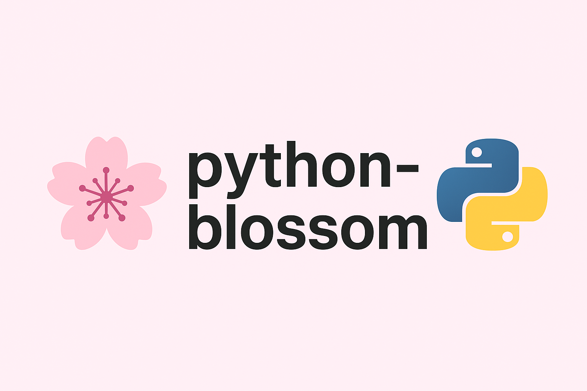

# blossom-python

<div align="center">
  
</div>

High-level Python client for the Blossom protocol (blob storage via Nostr auth).

Implements core BUDs:
- BUD-01: Blob retrieval (GET/HEAD)
- BUD-02: Upload, List, Delete
- BUD-03: User Server List event generation (kind 10063)
- BUD-04: Mirror blob
- BUD-05: Media optimization (optional endpoints)
- BUD-06: Upload requirements (HEAD /upload)

## Installation

Install from PyPI (coming soon):
```bash
pip install blossom-python
```

Or install locally with pipenv:
```bash
pipenv install
```

For development:
```bash
pipenv install --dev
```

## Quick Start

```python
from blossom_python import BlossomClient

nsec = 'nsec....'  # Your Nostr private key (nsec)
servers = [
    'https://blossom.band',
    'https://nostr.download',
    'https://blossom.primal.net'
]

client = BlossomClient(nsec=nsec, default_servers=servers)

# Upload blob data
result = client.upload_blob(servers[0], data=b'blob data', mime_type='image/png')
sha256 = result['sha256']
print(f"Uploaded: {result['url']}")

# Get blob
blob = client.get_blob(servers[0], sha256, mime_type='image/png')
downloaded_data = blob.get_bytes()
print(f"Downloaded: {len(downloaded_data)} bytes")

# HEAD request to check blob metadata
meta = client.head_upload_requirements(servers[0], data=b'blob data', mime_type='image/png')
print(f"Server supports: {meta}")

# List user's blobs
blobs = client.list_blobs(servers[0], pubkey_hex=client.pubkey_hex, use_auth=True)
print(f"Found {len(blobs)} blobs")

# Delete blob
client.delete_blob(servers[0], sha256, description='Cleanup')

# Mirror blob to another server
mirror_result = client.mirror_blob(servers[1], servers[0], sha256)
print(f"Mirrored to: {mirror_result['url']}")

# Generate User Server List event (kind 10063, BUD-03)
event = client.generate_server_list_event(servers=servers)
print(f"Event ID: {event['id']}")

# Publish server list event to relays
event_id = client.publish_server_list_event(relays=['wss://relay.damus.io'])
print(f"Published: {event_id}")
```

## API Methods

### Upload & Download

**`upload_blob(server, data=None, file_path=None, mime_type=None, description=None, use_auth=False)`**
- Upload blob data (raw bytes or file)
- Auto-detects MIME type if not specified
- Returns blob descriptor with `sha256`, `url`, `size`, `type`

**`get_blob(server, sha256, mime_type=None, use_auth=False)`**
- Download blob by SHA256 hash
- Returns `Blob` object with `content`, `sha256`, `mime_type` properties
- Call `blob.get_bytes()` or `blob.save(file_path)` to access data

**`head_upload_requirements(server, data=None, file_path=None, mime_type=None, use_auth=False)`**
- Check server upload requirements before uploading
- Returns headers: `content_type`, `content_length`, `accept_ranges`

### Media (BUD-05)

**`media_upload(server, data=None, file_path=None, mime_type=None, description=None, use_auth=False)`**
- Upload blob with media optimization
- Returns blob descriptor

**`media_head(server, data=None, file_path=None, mime_type=None, use_auth=False)`**
- Check media upload requirements
- Returns headers

### Blob Management

**`list_blobs(server, pubkey_hex=None, cursor=None, limit=None, use_auth=False)`**
- List blobs for a public key
- Returns list of blob descriptors
- Requires `use_auth=True` for private server listings

**`delete_blob(server, sha256, description=None)`**
- Delete blob from server
- Requires authorization
- Returns confirmation

**`mirror_blob(server, media_url, sha256, description=None)`**
- Mirror blob from one server to another
- Returns blob descriptor on destination server

### Head Blob

**`head_blob(server, sha256, use_auth=False)`**
- Get blob metadata without downloading content
- Returns headers: `content_type`, `content_length`, `accept_ranges`

### Server Management

**`fetch_server_list(relay_url, pubkey_hex=None)`**
- Fetch server list event (kind 10063) from relay
- Returns list of servers from event tags

**`generate_server_list_event(servers=None)`**
- Generate user server list event (BUD-03, kind 10063)
- Automatically signed with your key
- Returns Nostr event dict

**`publish_server_list_event(servers=None, relays=None)`**
- Generate and publish server list event to relays
- Returns event ID

## Authorization

Methods with `use_auth=True` parameter automatically generate NIP-98 authorization events:
- kind 24242
- Tags: `t=<verb>`, `expiration`, `x=<hash>` (when applicable)
- Base64 encoded in `Authorization: Nostr <base64>` header
- Auto-signed with your private key

## Error Handling

Raises `BlossomError` or specific subclasses on errors:
- `InvalidAuthorizationEvent`: 401 auth failure
- `BlobNotFound`: 404 blob not found
- `TooManyRequests`: 429 rate limit
- `BlossomError`: Other HTTP errors

```python
from blossom_python.errors import BlobNotFound, TooManyRequests

try:
    blob = client.get_blob(server, sha256)
except BlobNotFound:
    print("Blob not found")
except TooManyRequests:
    print("Rate limited - try again later")
```

## License

Unlicense / Public Domain (matches upstream Blossom spec repository).
